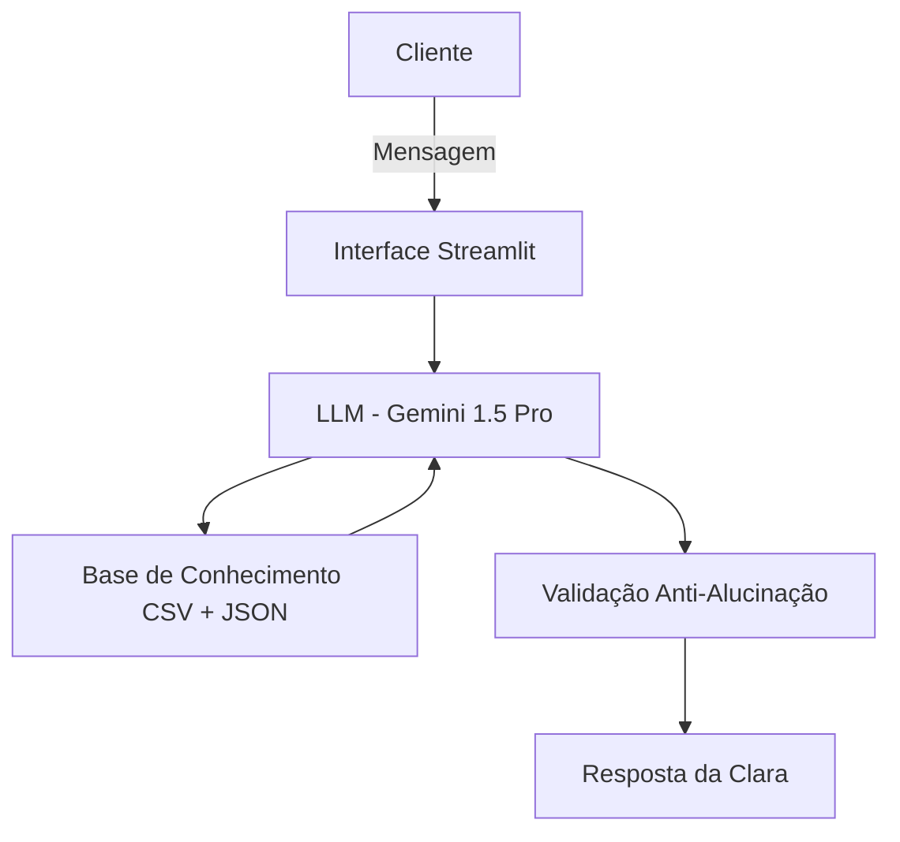

# 💰 Clara — Assistente Financeira Inteligente

> *"Olá! Sou a Clara. Como estão seus planos financeiros hoje? Vamos organizar essas contas!"*

Clara é uma assistente financeira com IA Generativa criada para ser sua parceira de responsabilidade financeira. Ela lê seu histórico de transações, monitora orçamentos, emite alertas proativos e sugere ajustes práticos para que você atinja sua meta de economia — tudo de forma acessível, sem jargões bancários.

---

## 🎯 O Problema que a Clara Resolve

Muitas pessoas perdem o controle das finanças não por falta de vontade, mas por falta de tempo e de ferramentas simples. Planilhas complexas ficam para depois, e as surpresas chegam no fim do mês.

**A Clara muda isso.** Ela funciona como uma mentora amigável: analisa seus gastos, avisa quando você está se aproximando do limite de uma categoria e te ajuda a construir uma reserva de emergência com passos pequenos e consistentes.

### Público-alvo
Jovens profissionais, autônomos e adultos entre 20 e 35 anos que querem organizar a vida financeira de forma prática, criando hábitos saudáveis e alcançando metas de curto e médio prazo.

---

## ✨ O que a Clara faz

- 📊 **Analisa gastos** por categoria com base no seu extrato
- 🔔 **Emite alertas proativos** quando os gastos se aproximam do limite
- 🎯 **Monitora metas** de economia mensais
- 💡 **Sugere produtos conservadores** (Tesouro Direto, CDB, Renda Fixa)
- 🤝 **Mantém continuidade** do atendimento com base no histórico de interações

### O que a Clara **não** faz
- ❌ Não realiza transações financeiras
- ❌ Não recomenda ações, criptomoedas ou renda variável
- ❌ Não acessa cotações ou dados de mercado em tempo real
- ❌ Não substitui contadores nem emite declarações de IR

---

## 🗂️ Estrutura do Repositório

```
📁 lab-agente-financeiro/
│
├── 📄 README.md
│
├── 📁 data/                          # Dados mockados para o agente
│   ├── historico_atendimento.csv     # Histórico de atendimentos anteriores
│   ├── perfil_investidor.json        # Perfil e metas do cliente
│   ├── produtos_financeiros.json     # Produtos de renda fixa disponíveis
│   └── transacoes.csv                # Histórico de transações
│
├── 📁 docs/                          # Documentação do projeto
│   ├── 01-documentacao-agente.md     # Caso de uso e arquitetura
│   ├── 02-base-conhecimento.md       # Estratégia de dados
│   ├── 03-prompts.md                 # Engenharia de prompts
│   ├── 04-metricas.md                # Avaliação e métricas
│   └── 05-pitch.md                   # Roteiro do pitch
│
├── 📁 src/                           # Código da aplicação
│   ├── app.py                        # Interface Streamlit
│   ├── agente.py                     # Lógica do agente (Gemini + Pandas)
│   ├── config.py                     # Variáveis de ambiente e segurança
│   └── requirements.txt              # Dependências do projeto
│
├── 📁 assets/                        # Imagens e diagramas
│
└── 📁 examples/                      # Referências e exemplos
    └── README.md
```

---

## 🏗️ Arquitetura



| Componente | Tecnologia | Descrição |
|------------|------------|-----------|
| Interface | Streamlit | Chatbot web interativo e fluido |
| LLM | Gemini 1.5 Pro | Análise de dados e raciocínio lógico |
| Base de Conhecimento | Pandas + CSV/JSON | Leitura e pré-processamento dos dados do cliente |
| Validação | Módulo customizado | Checa cálculos e filtra respostas de risco |

---

## 🚀 Como Rodar

### Pré-requisitos
- Python 3.9+
- Uma chave de API do [Google AI Studio](https://aistudio.google.com/)

### Instalação

```bash
# 1. Clone o repositório
git clone https://github.com/thiago-henrique-martins/dio-lab-bia-do-futuro.git
cd dio-lab-bia-do-futuro

# 2. Instale as dependências
pip install -r src/requirements.txt

# 3. Configure sua chave de API
# Crie um arquivo .env na raiz do projeto:
echo "GOOGLE_API_KEY=SUA_CHAVE_AQUI" > .env

# 4. Rode a aplicação
streamlit run src/app.py
```

---

## 🛡️ Segurança e Anti-Alucinação

A Clara foi projetada com foco em confiabilidade:

- **Respostas baseadas em dados:** Responde estritamente com base nos arquivos carregados, nunca inventando números ou transações.
- **Admissão de lacunas:** Quando os dados são insuficientes, ela pede a informação ao usuário em vez de adivinhar.
- **Filtro de produtos:** Expõe à Clara apenas produtos de baixo risco (Tesouro Direto, CDB, fundos conservadores).
- **Sem dados de terceiros:** Não compartilha informações de outros usuários sob nenhuma circunstância.
- **Credenciais seguras:** Chaves de API gerenciadas via `.env` com `python-dotenv` — nunca expostas no código.

---

## 📊 Resultados dos Testes

| Métrica | Resultado |
|---------|-----------|
| Assertividade nas respostas | ✅ Correto |
| Segurança (sem alucinações) | ✅ Correto |
| Coerência com o perfil conservador | ✅ Correto |
| Rejeição de perguntas fora do escopo | ✅ Correto |
| Tempo médio de resposta | ~2,5 segundos |

---

## 🛠️ Ferramentas Utilizadas

| Categoria | Ferramenta |
|-----------|------------|
| LLM | Gemini 1.5 Pro (Google AI) |
| Interface | Streamlit |
| Processamento de dados | Pandas |
| Variáveis de ambiente | python-dotenv |

---

## 👨‍💻 Autor

Feito por **Thiago Henrique Martins** como parte do desafio de IA Generativa da [DIO](https://www.dio.me/).

[](https://github.com/thiago-henrique-martins)
