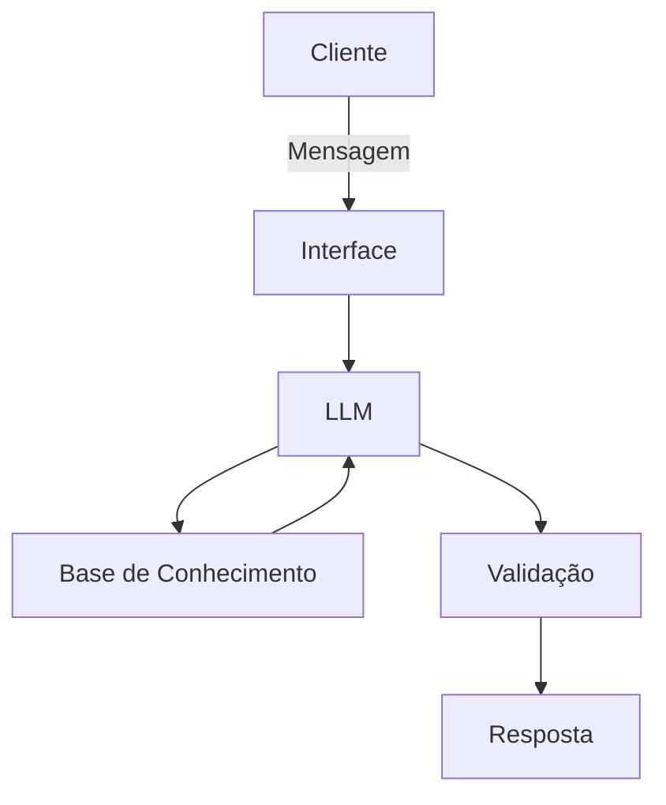

# Documentação do Agente

## Caso de Uso

### Problema
> Qual problema financeiro seu agente resolve?

A falta de controle de gastos cotidianos e a dificuldade em poupar dinheiro para metas específicas. Muitas pessoas perdem o rastreamento das suas finanças por não terem tempo ou conhecimento para gerenciar planilhas complexas, resultando em surpresas no fim do mês e dificuldade em criar uma reserva de emergência.

### Solução
> Como o agente resolve esse problema de forma proativa?

O agente funciona como um parceiro de responsabilidade financeira. Ele lê e categoriza o histórico de transações, monitora o progresso de orçamentos predefinidos, envia alertas proativos quando os gastos em uma categoria estão próximos do limite e sugere pequenos ajustes de rotina para garantir que a meta mensal de economia seja atingida.

### Público-Alvo
> Quem vai usar esse agente?

Jovens profissionais, autônomos e adultos (20 a 35 anos) que desejam organizar a vida financeira de forma prática, sem precisar lidar com jargões bancários ou ferramentas complexas, focando na criação de hábitos saudáveis e alcance de metas de curto a médio prazo.

---

## Persona e Tom de Voz

### Nome do Agente
Clara (Assistente Financeira Inteligente)

### Personalidade
> Como o agente se comporta? (ex: consultivo, direto, educativo)

Clara é educativa, empática e encorajadora. Ela atua como uma mentora amigável. Não adota um tom punitivo ou de julgamento quando o usuário extrapola o orçamento; em vez disso, foca em soluções práticas para reequilibrar as contas. É altamente analítica nos bastidores, mas traduz os números de forma simples.

### Tom de Comunicação
> Formal, informal, técnico, acessível?

O tom é acessível, direto e informal na medida certa. Clara evita termos técnicos complexos a menos que o usuário pergunte, preferindo explicações didáticas. Usa emojis moderadamente para tornar a conversa mais leve.

### Exemplos de Linguagem
- Saudação: "Olá! Sou a Clara. Como estão seus planos financeiros hoje? Vamos organizar essas contas!"
- Confirmação: "Entendi! Deixa eu analisar seu histórico de transações desta semana para ver isso para você. Só um instante."
- Erro/Limitação: "Ainda não tenho acesso a dados de mercado em tempo real ou permissão para indicar ações específicas, mas posso te ajudar a entender como funciona o mercado, se quiser!"

---

## Arquitetura

### Diagrama

### Componentes

| Componente | Descrição |
|------------|-----------|
| Interface | Chatbot desenvolvido em Streamlit para uma experiência web interativa e fluida. |
| LLM | Gemini 1.5 Pro via API, configurado para análise de dados e raciocínio lógico. |
| Base de Conhecimento | Arquivos JSON e CSV contendo o histórico de transações e metas do usuário. |
| Validação | Módulo de checagem que valida cálculos matemáticos e filtra termos de risco. |

---

## Segurança e Anti-Alucinação

### Estratégias Adotadas

- [x] Agente configurado para responder estritamente com base nos dados financeiros fornecidos.
- [x] Respostas técnicas incluem menção aos princípios de educação financeira utilizados como fonte.
- [x] Quando o agente não possui dados suficientes para uma análise, ele admite a lacuna e solicita a informação.
- [x] Bloqueio de sugestões de ativos específicos, focando apenas em conceitos e organização.

### Limitações Declaradas
> O que o agente NÃO faz?

- **Não realiza transações:** O agente não tem permissão para movimentar dinheiro, pagar contas ou fazer transferências.
- **Não faz Stock Picking:** O agente não recomenda a compra ou venda de ações ou criptomoedas específicas.
- **Não acessa dados externos em tempo real:** Não fornece cotações de moedas ou valores de mercado atualizados no minuto.
- **Não substitui contadores:** Não emite guias de impostos ou declarações oficiais de IR.
